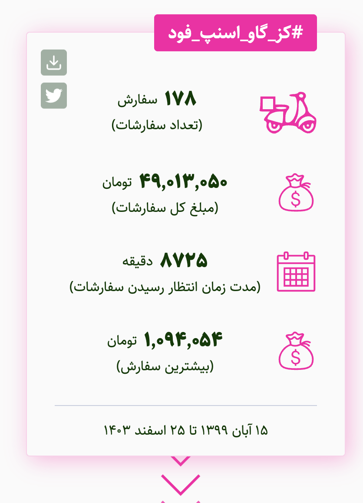
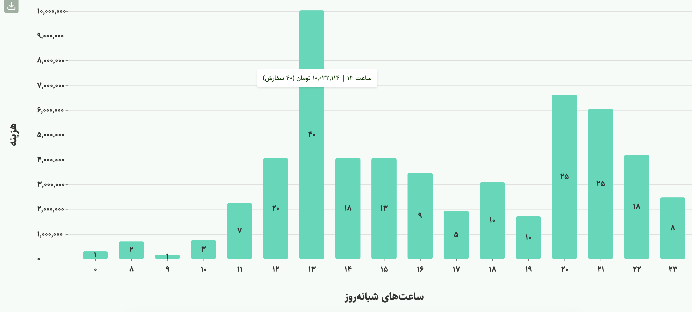
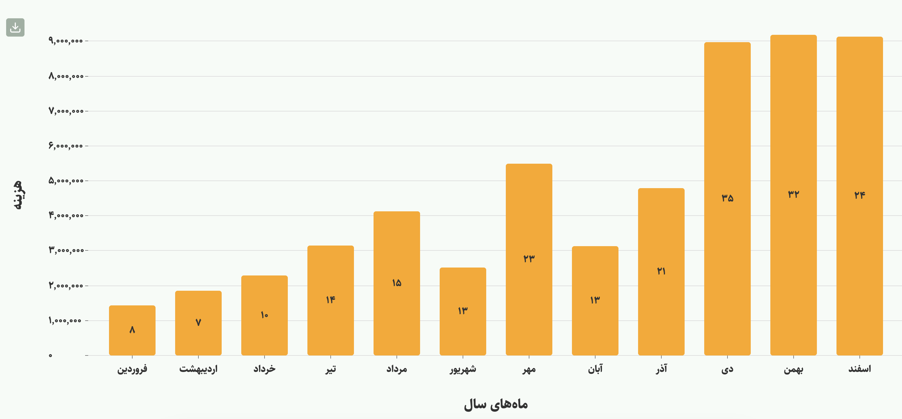
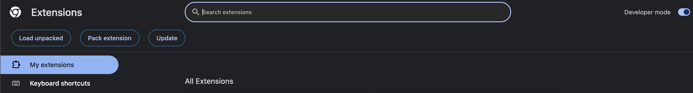

# KozeGaav Chrome Extension

Getting your rides and food orders history from [Snapp application][snapppwa] and [Snappfood][snappfood].





# What is Snapp?

You can think of [Iranian version of Uber][snappwiki]. Their public repository is available [here][snapprepo].

# What is Snappfood?

[Snappfood][snappfood] is Iran's leading online food delivery platform, similar to UberEats or DoorDash. It's part of the Snapp! ecosystem, allowing users to order food from thousands of restaurants across Iran.

# Features

- View your Snapp ride history with detailed statistics
- View your Snappfood order history with detailed statistics
- See your biggest Snappfood order
- View statistics by hour, day, week, month, and year
- View total spending and count for rides/orders
- Beautiful charts and visualizations
- Data caching for faster access
- Automatic update detection for new rides/orders

# Installation

## Quick Start (Until we publish in Chrome store)



1. Unzip the extension, you can download it from GitHub releases or the [telegram channel](https://t.me/UselessCodes).
2. Go to Chrome > Extensions > Manage Extensions and enable Developer Mode
3. Click on "Load Unpacked" on Chrome Manage extensions page and choose the unzipped folder
4. Sign in to your Snapp account at [app.snapp.taxi][snapppwa] and your Snappfood account at [snappfood.ir][snappfood]
5. Click on the extension icon in Chrome to view your statistics!

## Development Setup

Start development server (use dist folder to install on Chrome):
```bash
cd kozegaav
npm ci && cd src/popup && npm ci && cd ../..
npm start
```

Build extension package:
```bash
npm run tada  # Creates kozegaav.zip
```

# How the Extension Works?

## For Snapp Rides:
1. After installing the extension you need to sign in to your Snapp account
2. When you open [https://app.snapp.taxi][snapppwa], a script injects into the HTML `body`
3. The script reads `access-token` from the page and creates a new `CustomEvent` with `access-token` and dispatches it via `window`
4. In `contentscript` we listen to the upcoming event message from the injected script. After getting the message, we save `access-token` using [chrome.storage][chromestorage] API
5. Every time you click on the extension's icon, we read `access-token` from `chrome.storage` and set it as a state in the mounted React component (popup)
6. When you click on "Get Snapp Rides", the app requests data from Snapp API with your `access-token`
7. After your data is received, we use `chrome.storage` for caching. Next time you click the button, we first check if there are new rides before fetching all data again

## For Snappfood Orders:
1. Sign in to your Snappfood account at [snappfood.ir][snappfood]
2. When you click "Get Snappfood Orders" in the extension, we use your browser's cookies to authenticate with Snappfood's API
3. The app fetches your order history page by page and processes the data
4. Like with Snapp rides, we cache the data and check for new orders before fetching everything again
5. All data processing happens locally in your browser

# Privacy Policy

**All codes executed on the client-side** and the extension is only for **personal usage**. For analyzing the data:
- For Snapp rides, we need your local `access-token` from the Snapp PWA
- For Snappfood orders, we use your browser's cookies to authenticate with Snappfood
- All authentication data is saved in chrome storage API
- You can remove the extension at any time to destroy all stored data completely
- No data is ever sent to any third-party servers
- All data processing happens locally in your browser

The extension only accesses the minimum required data to show your ride and order statistics. Your privacy and data security are our top priority.

# Credits & Background

This extension is a fork and enhancement of [My Snapp](https://github.com/sepehrity/my-snapp-extension), which is no longer maintained. We've built upon the original project by:
- Fixing compatibility with recent Chrome updates
- Adding Snappfood integration
- Adding new statistics and visualizations
- Improving data caching and performance
- Enhancing the user interface
- Implementing automatic update detection

Special thanks to the original My Snapp developers for laying the groundwork for this project.

[snapppwa]: https://app.snapp.taxi
[snappwiki]: https://en.wikipedia.org/wiki/Snapp!
[snapprepo]: https://github.com/snapp-cab
[chromestorage]: https://developer.chrome.com/extensions/storage
[snappfood]: https://snappfood.ir
